# Jogo de Xadrez Completo
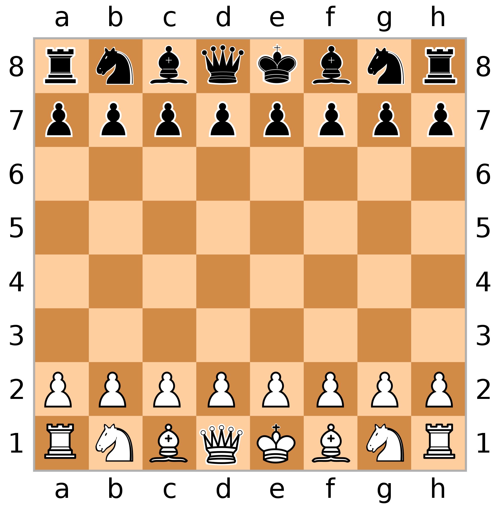

Aplicação realizada por mim baseado nas aulas do Projeto Chess-System do Curso de JAVA Completo Programação Orientação a Objetos + Projetos.

Este curso está disponível para compra através da plataforma <a href="https://www.udemy.com/course/java-curso-completo">Udemy</a>. Disponho todos créditos necessários ao professor Nélio Alves (bacharel em Ciência da Computação e mestrado e doutorado em Engenharia de Software pela Universidade Federal de Uberlândia) idealizador do projeto no curso.

## :mag_right:Sobre o projeto
O jogo de xadrez (ChessGame) pode ser classificado como um jogo de tabuleiro de estratégia (do tipo recreativo ou competitivo) para dois jogadores. Considerado como uma arte, esporte e também ciência. O jogo apesar de conter um conjunto de regras simples ele é extremamente tático que exige dos jogadores reflexão sobre as suas jogadas.

Nossa implementação basea-se no tabuleiro padrão de 8x8 em que consta 16 peças pretas e 16 peças brancas. As linhas foram númeradas de 1 a 8 e as colunas de letra a - h.

Dessas 16 peças cada jogador possui: 8 peões, 2 cavalos, 2 bispos, 2 torres, 1 rei e 1 rainha. Cada peça possui um movimento especifico no tabuleiro:

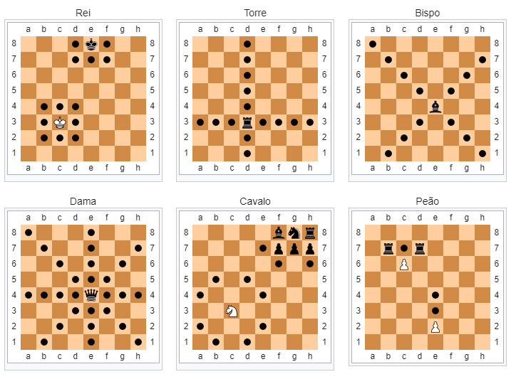

## :art: Layout
### Terminal
Nossa implementação foi realizada usando como interface para interação o terminal do **GitBash** (Um terminal é um ambiente de entrada e saída de texto). Essa escolha se deve ao terminal do GitBash poder apresentar cores, sendo implementada um cor distinta entre as peças dos dois jogadores. Porém o programa também pode ser executando dentro de uma **IDE** de sua preferência.

Quando uma peça é capturada ela fica armazenada em uma lista que pode ser visulizada no trecho "Captured pieces".

Além disto a implementação exibe o turno do jogador e qual cor.

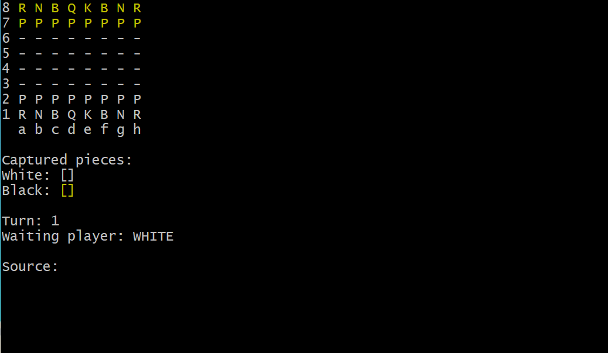

### Movimentações
Para cada peça foi atribuída uma letra maiuscúla, seguindo a seguinte legenda:
|  Peças   |     Letra   |
|----------|:-----------:|
| Rei (King)     | K |
| Rainha (Queen) | Q |
| Torre (Rook)   | R |
| Peão (Pawn)    | P |
| Cavalo (Knight)| N |
| Bispo (Bishop) | B |

O sistema de comando de entrada e saída se dá através da letra da coluna seguida da linha, exemplo de movimentação: *Source*: **b2** *Target*: **b4**

#### Exemplos de movimentações por peça.
Na aplicação as posições possíveis de serem movidas da peça escolhida ficam sinalizadas por um background de cor azul.

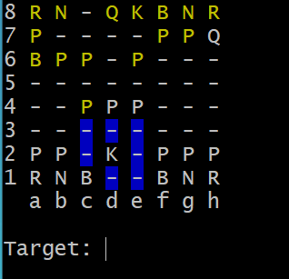
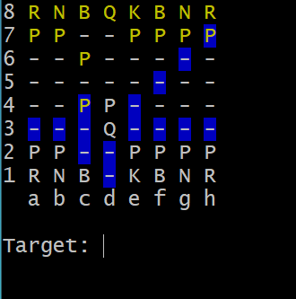
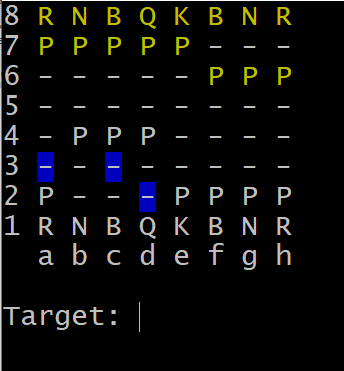
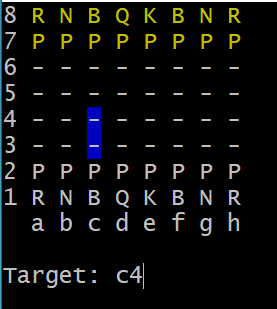
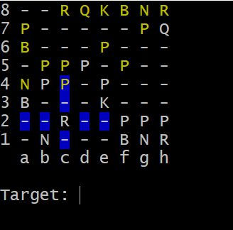
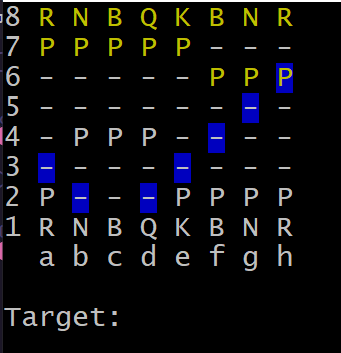

##:bulb: Jogadas especiais
Em um jogo de xadrez existem movimentações (jogadas) em situações específicas que são conhecidas como **jogadas especiais**, no nosso projeto houve a implementação de 3 jogadas especiais:
- *En Passant* : movimento especial de captura do Peão no jogo de xadrez. Na ocasião do avanço por duas casas do peão, caso haja um peão adversário na coluna adjacente na quarta fileira para as brancas, ou quinta para as pretas, este pode capturar o peão como se "de passagem", movendo-o para a casa por onde o peão capturado passou sobre. A captura en passant deve ser feita imediatamente após o peão ter sido movido por duas casas.
Podemos ver que a posição c5 que se encontra o peão do adversário é uma posição possível para o peão b4, devido ao movimento especial.
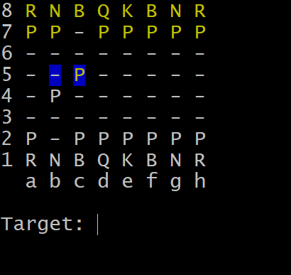

- *Castling (Roque)*: jogada especial que envolve a movimentação de duas peças em um único lance, o rei e uma das torres. O objetivo da jogada é proteger o rei, tirando-o do centro.
Antes de executar a jogada, é necessário o atendimento aos seguintes requisitos: O rei e a torre envolvida não podem ter se movimentado nenhuma vez desde o início do jogo. As casas entre o rei e a torre devem estar desocupadas. O rei não pode estar em xeque, e também não pode ficar em xeque depois do roque. Nenhuma das casas onde o rei passar ou ficar deverá estar no raio de ação de uma peça adversária (Isto não se aplica à torre envolvida).
Na imagem abaixo podemos ver um exemplo do roque à esquerda (roque pequeno), vemos que a posição g1 como uma possível movimentação e que posteriormente ao roque realizado a torre e o rei mudaram de posição.

 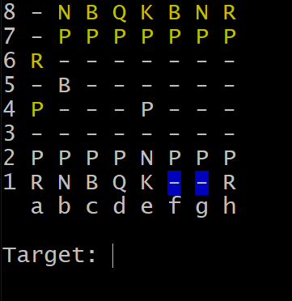
 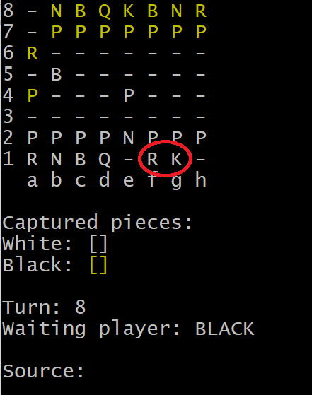

- *Promotion (Promoção)*: a promoção é a substituição de um peão por uma nova peça quando o peão é movido para sua última posição. O jogador substitui o peão imediatamente por uma rainha , torre , bispo ou cavalo da mesma cor. A promoção é obrigatória; o peão não pode permanecer como peão.
Nas imagens podemos ver que um peão ao se mover para sua última posição a aplicação questionará para qual tipo de peça o peão será promovido: "Enter piece for promotion (B/N/R/Q)". Após isso vemos na segunda imagem que o seu tipo mudou, no exemplo para Rainha.

 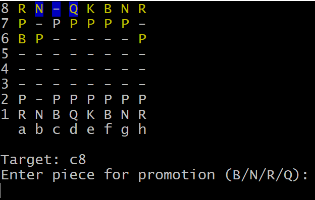
 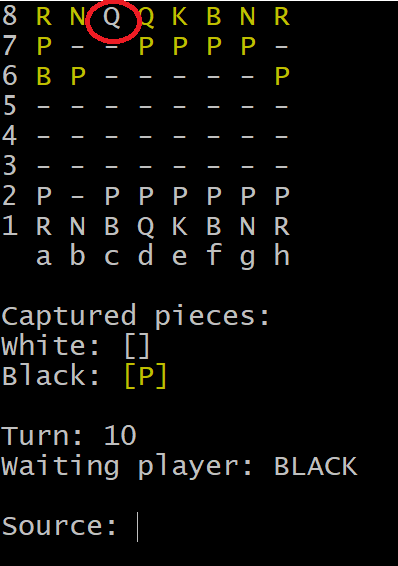

## :gear: Tecnologias/Ferramentas usadas
### IDE
- [Eclipse](https://www.eclipse.org/downloads/)
### Controle de Versão
- [Git](https://git-scm.com/)

## :file_folder: Como executar o projeto
Requisitos: 
- JAVA instalado na máquina
- Git instalado na máquina

### Clonar repositório
git clone https://github.com/DioneDw/chess-system-java.git

### Opção 1: Iniciar aplicação pelo terminal GitBash
Localizar a pasta do projeto no sua máquina e dentro da pasta localizar a pasta bin, exemplo:
*C:\Projetos\Chess_System\bin*
Clicar com o botão direito do mouse é após ter o git instalado podemos clicar na opção *Git Bash Here*, fazendo isso uma janela de terminal será aberta.

### Executar a aplicação
Dentro da janela do GitBash execute o seguinte comando:
*Java application/Program*
Será aberta a aplicação no terminal.

### Opção 2: Iniciar aplicação pela IDE
Dentro da pasta do projeto no ambiente de desenvolvimento localizar a opção "Run As" e escolher a opção *Java Application*
Será executada a aplicação na aba Console da sua IDE.

## :raising_hand_man: Autor
Dione Willy Evangelista
https://www.linkedin.com/in/dione-willy-evangelista-59ab8314a/
